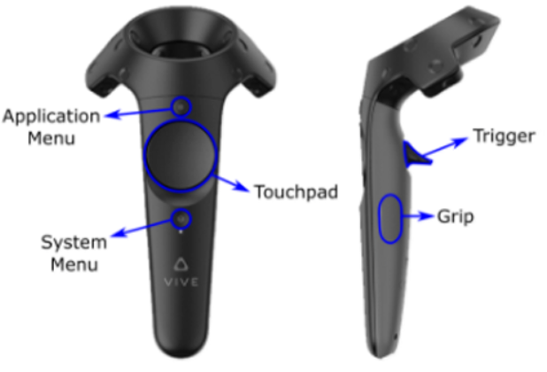

# 게임명
  

## 구현해야할 것
### 플레이어

1. 총 - 승현
   1. 권총  
      1. 장전
   
      | 기능 | 방법 | 
      |---|---| 
      | 탄창 빼는 법 | 오른쪽 `Grip` 버튼을 누른다.|
      | 탄창 넣는 법 | 인벤토리에서 꺼낸 탄창을 손잡이 부분에 넣는다 |
      | 장전 | Grip 버튼으로 총의 슬라이드 부분을 잡고 당긴다 |  
      | | |
      2. 발사 
         1. 레이케스트를 상시적으로 쏴서 도착지점의 좌표를 구한다.
         2. Trigger버튼을 누를 때 그 좌표에 오브젝트를 구한다.
            1. 몬스터일시 데미지를 준다.
            2. 땅에 탄피 자국과 이미지 스프라이트 생성
      3. 조준 `(만들어도 되고 안만들어도 됨)`
         1. 레이케스트를 쏴서 도착지점의 좌표를 구한다.
         2. 알아서 ㅎㅎ
2. 인벤토리 - 건우
   1. 아이템 상호작용
      
   | 기능 | 방법 | 
   |---|---| 
   | 아이템 획득 | 아이템을 Trigger버튼으로 집은 상태에서 HMD 뒤쪽으로 가져다 놓음 |
   | 탄창 꺼내기 | HMD 뒤쪽에서 Trigger버튼으로 집는다. |
   | 회복아이템 꺼내기 | HMD 뒤쪽에서 Grip버튼으로 집는다.|
   | 장전 | Grip 버튼으로 총의 슬라이드 부분을 잡고 당긴다 | 
   | 방독면 | Trigger버튼으로 방독면을 집은뒤 얼굴에 가져다 댐 |
   | | | 
   2. 회복템
      1. 꺼낸뒤 손에 뿌림
      2. 손으로 깨뜨림
      3. 먹는다.
      4. 방독면에 장착
   3. 키(카드, 열쇠)
3. 플레이어 UI - 승현
   1. 체력  
      - 체력바
   2. 탄창
   3. 무기 선택창
4. 이동 - 찬형
   1. 순간이동
      1. `Touch Pad`의 `12시 방향`을 누르면 이동 위치가 보임
         1. 이동 방법
            1. 직선 
            2. 곡선 (베지어 곡선 이용)
      2. 때면은 그곳으로 이동
   2. 방향 회전/ 이동
      1. `Touch Pad` `9시`와 `3시`로 좌우 회전
      2. 한틱당 45도
5. 중력장갑 - 찬형
   1. 물리적인 힘을 줘서 장갑까지 도달하는 힘 계산   
       - AddForce로 값 넣으면 끝  
   2. Lerp(Lerp, Lerp)로 포물선 이동, 콜리더로 충돌 체크 
   3. 직선으로 도착  
6. 마법
   1. 타게팅
      맨손일때 Grip버튼으로 대상을 지정
   2. 염력
      trigger + grip 물체 여러개 선택 가능
      버튼을 때면 타겟에 공격
---

1. 몬스터(래그돌, 원거리, 근접, 특수한 방법으로 잡는 적) - 승현
2. 거울을 이용한 퍼즐(몬스터에도 활용) - 승현
3. 미로 퍼즐 - 찬형
4. UI (게임 시작, 종료) 인게임(인벤토리, ESC창 UI) - 건우
5. 미니게임
